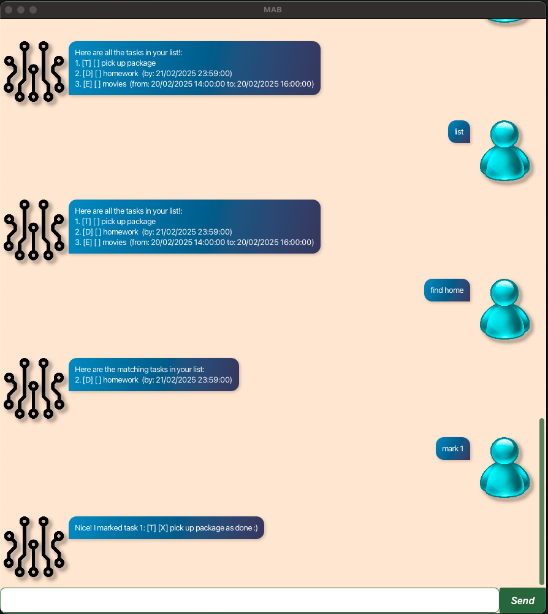

# Mab - Task Management Application

        ██╗  ██╗███████╗██╗     ██╗      ██████╗  ██╗        ██╗███╗   ███╗    ███╗   ███╗ █████╗ ██████╗ 
        ██║  ██║██╔════╝██║     ██║     ██╔═══██╗ ██║        ██║████╗ ████║    ████╗ ████║██╔══██╗██╔══██╗
        ███████║█████╗  ██║     ██║     ██║   ██║ ██║        ██║██╔████╔██║    ██╔████╔██║███████║██████╔╝
        ██╔══██║██╔══╝  ██║     ██║     ██║   ██║ ╚═╝        ██║██║╚██╔╝██║    ██║╚██╔╝██║██╔══██║██╔══██╗
        ██║  ██║███████╗███████╗███████╗╚██████╔╝ ██╗        ██║██║ ╚═╝ ██║    ██║ ╚═╝ ██║██║  ██║██████╔╝
        ╚═╝  ╚═╝╚══════╝╚══════╝╚══════╝ ╚═════╝  ╚═╝        ╚═╝╚═╝     ╚═╝    ╚═╝     ╚═╝╚═╝  ╚═╝╚═════╝ 

Mab is a **desktop app for managing tasks and todos, optimized for use via a Command Line Interface** (CLI). If you can type fast, Mab can get your task management done faster than traditional GUI apps.

* Table of Contents
{:toc}

--------------------------------------------------------------------------------------------------------------------

## Quick start

1. Ensure you have Java `17` or above installed in your Computer.

1. Download the latest `.jar` file from the Releases page.

1. Copy the file to the folder you want to use as the _home folder_ for your Mab.

1. Open a command terminal, `cd` into the folder you put the jar file in, and use the `java -jar mab.jar` command to run the application. 
   

1. Some example commands you can try:

   * `list` : Lists all tasks.
   * `todo Buy groceries` : Adds a todo task.
   * `deadline Complete report /by 2024-02-20 12:20` : Adds a task with deadline.
   * `event Team meeting /from 2024-02-21 13:00 /to 2024-02-22 15:00` : Schedules an event.
   * `delete 3` : Deletes the 3rd task shown in the current list.

1. Refer to the [Features](#features) below for details of each command.

--------------------------------------------------------------------------------------------------------------------

## Features

**:information_source: Notes about the command format:** 
* Words in `UPPER_CASE` are the parameters to be supplied by the user. 
  e.g. in `todo DESCRIPTION`, `DESCRIPTION` is a parameter which can be used as `todo Buy groceries`.
* Parameters for dates should be in the format `DD-MM-YYYY`. 
* If you are using a PDF version of this document, be careful when copying and pasting commands that span multiple lines.

### Adding a todo: `todo`

Adds a basic todo task to the task list.

Format: `todo DESCRIPTION`

Examples:
* `todo Buy groceries`
* `todo Complete assignment`

### Adding a deadline: `deadline`

Adds a task with a deadline to the task list.

Format: `deadline DESCRIPTION /by DATE`

Examples:
* `deadline Complete report /by 2024-02-20 12:00`
* `deadline Submit homework /by 2024-03-15 11:00`

### Adding an event: `event`

Adds an event to the task list.

Format: `event DESCRIPTION /from START_DATE /to END_DATE`

Examples:
* `event Team meeting /from 2024-02-21 /to 2024-02-22 11:00`
* `event Conference /from 2024-04-01 /to 2024-04-03 11:00`

### Listing all tasks: `list`

Shows a list of all tasks.

Format: `list`

### Marking a task: `mark`

Marks a task as complete.

Format: `mark INDEX`

Examples:
* `mark 1` marks the first task as complete

### Unmarking a task: `unmark`

Marks a task as incomplete.

Format: `unmark INDEX`

Examples:
* `unmark 1` marks the first task as incomplete

### Finding tasks: `find`)

Finds tasks whose descriptions contain the given keyword.

Format: `find KEYWORD`

Examples:
* `find meeting` returns all tasks containing the word "meeting"

### Deleting a task: `delete`

Deletes a task from the list.

Format: `delete INDEX`

Examples:
* `delete 1` deletes the first task in the list

### Exiting the program: `bye`

Exits the program.

Format: `bye`

--------------------------------------------------------------------------------------------------------------------

## Command summary

Action | Format, Examples
-------|------------------
**Todo** | `todo DESCRIPTION`  e.g., `todo Buy groceries`
**Deadline** | `deadline DESCRIPTION /by DATE`  e.g., `deadline Complete report /by 2024-02-20`
**Event** | `event DESCRIPTION /from START_DATE /to END_DATE`  e.g., `event Team meeting /from 2024-02-21 /to 2024-02-22`
**List** | `list`
**Mark** | `mark INDEX`  e.g., `mark 2`
**Unmark** | `unmark INDEX`  e.g., `unmark 2`
**Find** | `find KEYWORD`  e.g., `find meeting`
**Delete** | `delete INDEX`  e.g., `delete 1`
**Exit** | `bye`
